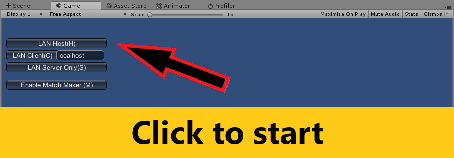
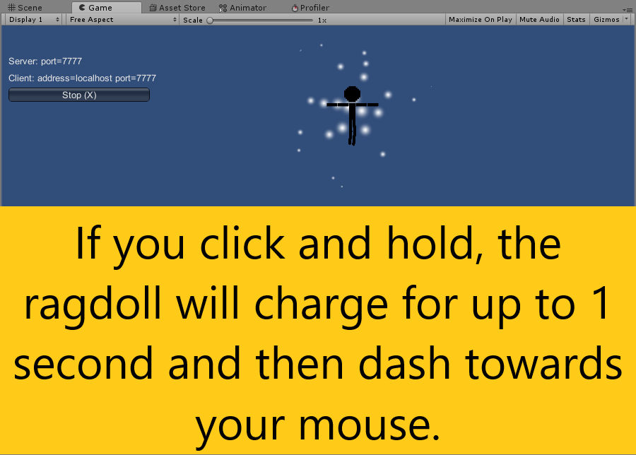
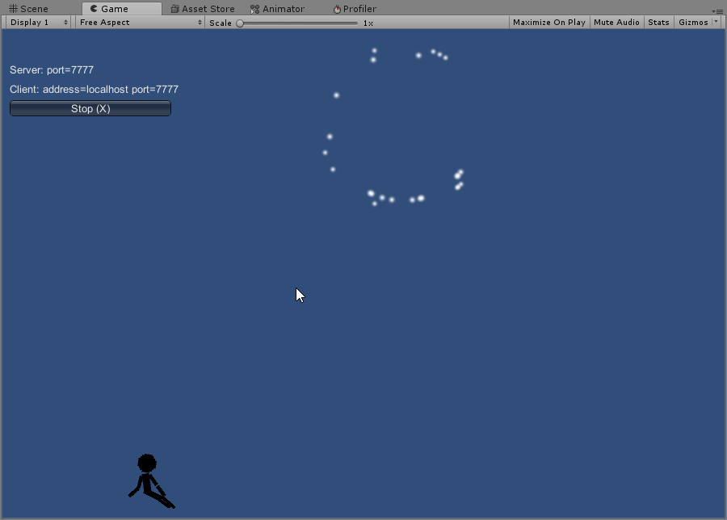
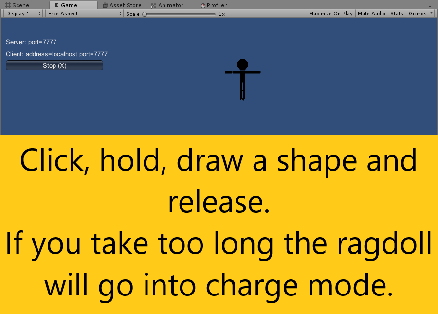
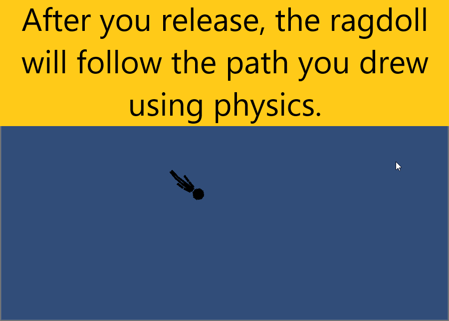
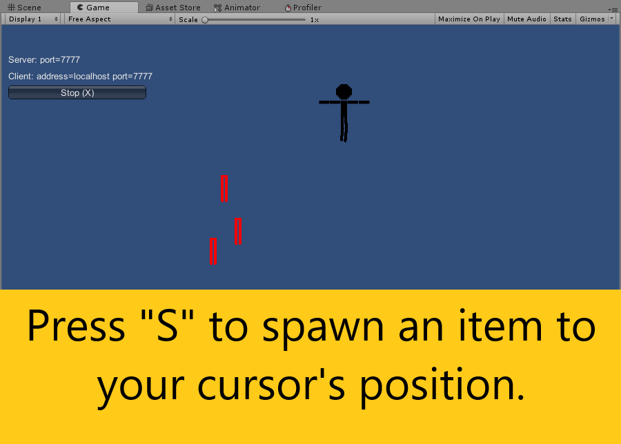
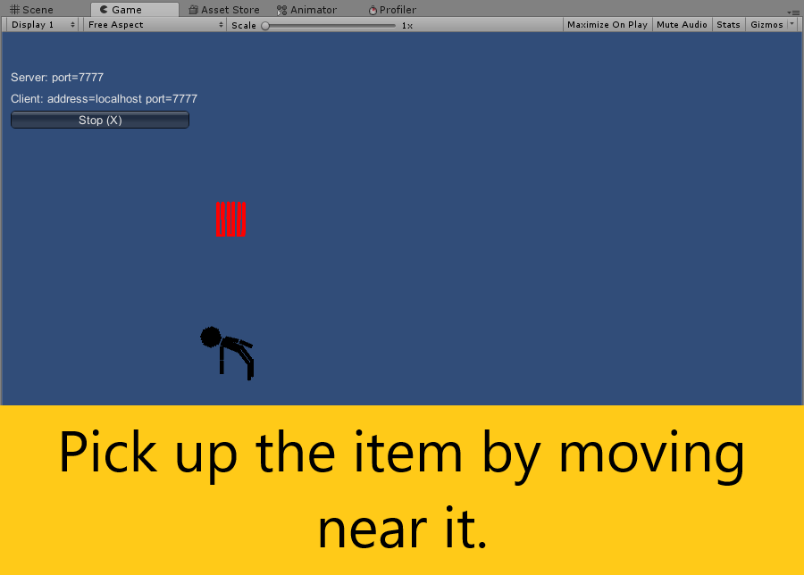

# Ragdoll
A ragdoll game in Unity3D coded with C#.

Displays a good understanding of trigonometry and code optimisation.

# Start
Press "Lan Host" to start the game. This is a result of my attempt to implement multiplayer functionality, which in theory should be mostly ready to work.

# Ability: Charge
Charging can be unpredictable as it doesn't show the player's direction to other players. It also freezes the caster in place. The left mouse button needs to be held for a brief time before the charge is initiated. 

# Ability: Draw Movement
One can draw an imaginary trail using the left mouse button. If done quickly enough (so that the character doesn't begin to charge), on release, the player character will starting moving, following the trail drawn. Note that it relies on physics, so rapid change of direction are difficult to perform as one needs to overcome the ragdoll's inertia first.

# Items
Create items by pressing "S". Each item will be neatly positioned and attached to the character upon pickup. With some careful calculations, each item lifts the charcater just slightly in order to make it float. The more items collected, the more the character floats.

